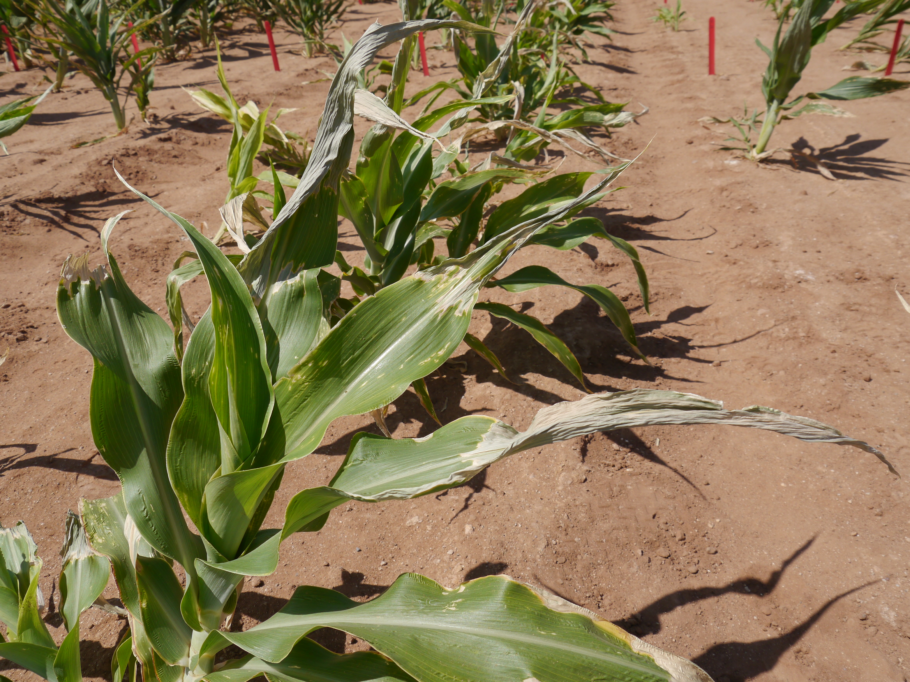

# Classification & Quantification of Charcoal Rot of Sorghum

## Background

### Biological problem
Sorghum is the fifth most widely grown cereal crop, capable of growing on marginal lands not suitable for other crops. Charcoal rot of sorghum (CRS), a disease caused by the pathogen M. phaseolina, poses a significant threat to sorghum, as it reduces yields and thus has signficant economic effects. Developing machine learning (ML) models that can categorize and quantify CRS would be immediately useful to growers and breeders, and as a way to identify variation in disease resistance to use in crop improvement efforts.

<p align="center">
  
  <div style="width: 50%; margin: auto;">Charcoal rot of sorghum (CRS) symptoms in sorghum plant grown in Maricopa, Arizona.</div>
</p>

### Model Types
This algorithm detects CRS using various classes of machine learning models, including:

- Classification
    - ResNet18
    - MobileNetV3 small
    - MobileNetV3 small custom 
    - MobileNetV3 large
    - EfficientNet-B3
    - EfficientNet-B4 (Koonce 2021a)

- Segmentation
    - U-NET
    - Fully Convolutional Network (FCN)
    - DeepLabV3

---

## Running Code
To run either training or inference, you will need to download the dataset [here](https://data.cyverse.org/dav-anon/iplant/projects/phytooracle/season_11_sorghum_yr_2020/level_0/charcol_rot_sorghum/dry_rot_raw.tar.gz). This archive file (.tar) contains both original and annotated images.

### Training
Training requires: (i) experiment file, (ii) 

#### Generate Experiment File
A JSON file with hyperparameters experiments is produced to conduct a hyperparameter grid search, aimed at identifying the optimal hyperparameters for both classification and segmentation models. To generate this file, run:

##### Classification

```
python3 model_training/training_and_inference/generate_hyperparameter_experiments.py --path hyperparameter_experiment --name classification --type c
```

##### Segmentation

```
python3 model_training/training_and_inference/generate_hyperparameter_experiments.py --path hyperparameter_experiment --name segmentation --type s
```

#### Train models

##### Classification
To train classification models, run:

```
python3 model_training/training_and_inference/run_next_experiment.py --path hyperparameter_experiment/classification_config_and_results_file.csv
```

##### Segmentation
To train segmentation models, run:

```
python3 model_training/training_and_inference/run_next_experiment.py --path hyperparameter_experiment/segmentation_config_and_results_file.csv
```

### Running Inference

#### Classification
To run inference and quantification using classification models and segmentation models, run:
```
./model_training/quantification_and_plots/run_all_quantifications.sh
```

#### Jupyter Notebook: Classification & Segmentation
We also provide a Jupyter notebook to visually assess the trained model's predictions:

```
model_training/quantification_and_plots/test_models_inference.ipynb
```

## Streamlit App
The models trained here can be deployed on a Streamlit app. The hosted app is accessible [here](https://charcoal-dryrot-quantification.streamlit.app/). The app can also be executed locally by utilizing Docker/Singularity.

### Docker
```
sudo docker run phytooracle/charcoal-dryrot-quantification:latest -- -i /opt/images/test_patches/
```

### Singularity
First, build the container:
```
singularity build crs.simg docker://phytooracle/charcoal-dryrot-quantification:latest
```

Then, run the app:
```
singularity exec -B $(pwd):/mnt --pwd /mnt --nv crs.simg streamlit run inference.py -- -i /opt/images/test_patches/
```